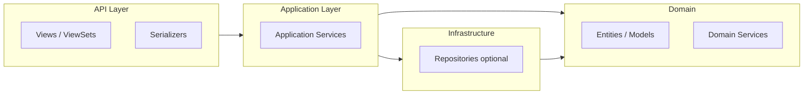

# Backend: DDD Django-style (DRF)

Бэкенд строится по идеям **Domain-Driven Design**, адаптированным под Django и DRF: один Django-приложение = один **bounded context**, внутри — разделение на домен, прикладные сервисы и API-адаптеры.

---

## Слои внутри приложения (Django app = Bounded Context)

Зависимости идут **внутрь**: API зависит от сервисов, сервисы — от домена и репозиториев. Домен не знает про HTTP и БД.



| Слой | Где в Django app | Ответственность |
|------|------------------|------------------|
| **API (вход)** | `views.py`, `serializers.py`, `urls.py` | HTTP, валидация ввода/вывода, вызов сервисов. Минимум бизнес-логики. |
| **Application (use cases)** | `services.py` или `application/` | Оркестрация: вызывают домен и репозитории, транзакции, права. |
| **Domain** | `models.py`, при необходимости `domain/` | Сущности, инварианты, доменная логика. Модели Django допускаются как сущности, если логика не размазана по view. |
| **Infrastructure** | Миграции, внешние вызовы, при необходимости `repositories.py` | Реализация персистентности, интеграции. В простых случаях — только ORM в сервисах. |

---

## Принципы

1. **ViewSet/View** — тонкий адаптер: парсит запрос, вызывает сервис, отдаёт сериализованный ответ. Не содержит правил вида «когда можно расторгнуть договор».
2. **Сервисы (application)** — сценарии: «создать договор», «активировать договор», «начислить платёж». Работают с моделями (или репозиториями), проверяют права, открывают транзакции.
3. **Модели (domain)** — сущности и инварианты. Бизнес-правила, которые не зависят от HTTP и БД, живут в моделях (методы) или в маленьких domain-сервисах.
4. **Сериализаторы** — DTO: вход/выход API. Не дублируют доменную логику; для сложных кейсов данные в сервис передаются явно (например, команда/дато-класс).

---

## Структура одного приложения (пример: `contracts`)

```
opc/apps/contracts/
  __init__.py
  models.py          # Domain: Contract, инварианты
  services.py         # Application: create_contract, activate_contract, ...
  serializers.py      # API: request/response DTO
  views.py            # API: ViewSets, вызов services
  urls.py
  admin.py
  migrations/
```

При росте можно ввести подпапки: `domain/`, `application/`, `api/` — но до необходимости лучше держать плоскую структуру.

---

## Переход от «толстых» ViewSet к сервисам

- **Сейчас:** логика часто в ViewSet или в `perform_create`/`perform_update`. Это допустимо на старте.
- **Целевое:** для нетривиальных операций выносить в `services.ContractService.create(...)`, а во view вызывать сервис. Сериализатор только валидирует вход и формирует ответ из результата сервиса.

---

## Границы контекстов

- **properties** — объекты и помещения (Property, Unit).
- **parties** — контрагенты (Party).
- **contracts** — договоры (Contract); зависит от properties.Unit и parties.Party через FK. Межконтекстное взаимодействие — по ID или по доменным событиям (позже), без прямого импорта моделей из другого контекста в доменный слой, где это можно избежать.
- **core** — общее: аутентификация, утилиты, Celery-таски.

Детали доменной модели (сущности, агрегаты) — в [ARCHITECTURE.md](ARCHITECTURE.md) (раздел «Доменные модули»).
