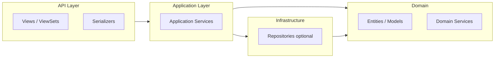

# Backend: DDD Django-style (DRF)

The backend follows **Domain-Driven Design** adapted to Django and DRF: one Django app = one **bounded context**, with separation into domain, application services, and API adapters.

---

## Layers inside an app (Django app = Bounded Context)

Dependencies point **inward**: API depends on services, services depend on domain and repositories. Domain does not know about HTTP or the database.



| Layer | Location in Django app | Responsibility |
|-------|------------------------|----------------|
| **API (entry)** | `views.py`, `serializers.py`, `urls.py` | HTTP, input/output validation, calling services. Minimal business logic. |
| **Application (use cases)** | `services.py` or `application/` | Orchestration: call domain and repositories, transactions, permissions. |
| **Domain** | `models.py`, optionally `domain/` | Entities, invariants, domain logic. Django models may serve as entities if logic is not scattered across views. |
| **Infrastructure** | Migrations, external calls, optionally `repositories.py` | Persistence, integrations. In simple cases — ORM in services only. |

---

## Principles

1. **ViewSet/View** — thin adapter: parse request, call service, return serialized response. Does not contain rules like "when a contract can be terminated".
2. **Services (application)** — scenarios: "create contract", "activate contract", "charge payment". Work with models (or repositories), check permissions, manage transactions.
3. **Models (domain)** — entities and invariants. Business rules that do not depend on HTTP or DB live in models (methods) or small domain services.
4. **Serializers** — DTOs: API input/output. Do not duplicate domain logic; for complex cases pass data explicitly to the service (e.g. command/dataclass).

---

## Structure of one app (example: `contracts`)

```
opc/apps/contracts/
  __init__.py
  models.py          # Domain: Contract, invariants
  services.py        # Application: create_contract, activate_contract, ...
  serializers.py     # API: request/response DTO
  views.py           # API: ViewSets, calling services
  urls.py
  admin.py
  migrations/
```

As it grows, subfolders like `domain/`, `application/`, `api/` can be added — but keep a flat structure until necessary.

---

## Moving from "fat" ViewSets to services

- **Current:** logic often in ViewSet or `perform_create`/`perform_update`. Acceptable at the start.
- **Target:** for non-trivial operations, move to `services.ContractService.create(...)` and call the service from the view. Serializer only validates input and builds response from service result.

---

## Context boundaries

- **properties** — properties and units (Property, Unit).
- **parties** — counterparties (Party).
- **contracts** — contracts (Contract); depends on properties.Unit and parties.Party via FK. Cross-context interaction — by ID or domain events (later), without importing models from another context into the domain layer when avoidable.
- **core** — shared: authentication, utilities, Celery tasks.

Domain model details (entities, aggregates) — in [ARCHITECTURE.md](ARCHITECTURE.md) (section "Domain modules").
